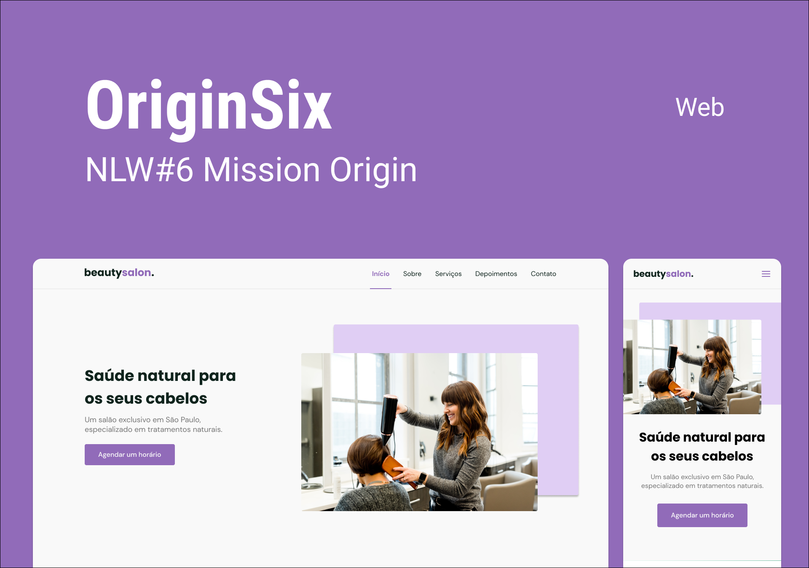

<h1 align="center">
  
</h1>

  
   

  <a href="#-Technologies">Technologies</a>&nbsp;&nbsp;&nbsp;|&nbsp;&nbsp;&nbsp;
  <a href="#-Project">Project</a>&nbsp;&nbsp;&nbsp;|&nbsp;&nbsp;&nbsp;
  <a href="#-Improvements">Improvements</a>&nbsp;&nbsp;&nbsp;|&nbsp;&nbsp;&nbsp;
  <a href="#-Layout">Layout</a>&nbsp;&nbsp;&nbsp;|&nbsp;&nbsp;&nbsp;
  <a href="#memo-License">License</a>

 

  

## 🚀 Tecnologias

This project was developed with the following technologies:

- HTML
- CSS
- JavaScript

Libraries

- [Google Fonts](https://fonts.google.com/)
- [SwipeJS](https://github.com/nolimits4web/Swiper)
- [ScrollReveal](https://scrollrevealjs.org)

Utilities

- [randomuser.me](https://randomuser.me/photos)
- [IconMoon](https://icomoon.io/app/#/select)

## 💻 Project

OriginSix is an institutional page in One Page format, responsive, to be used in various types of micro, small and medium-sized companies. Contains the following sections: Header, Navigation, Home, About, Services, Testimonials, Contact and Footer.

## 🛠 Improvements

The project was made following the tutorial provided by Rocketseat in NLW #6 and at the end of the whole process some changes were made in order to test the concepts learned and better absorb the content.

Changes:

- Changing the color palette;
- Use of different photos of the project;
- Use of a partially different text.

## 🔖 Layout

You can view the layout of the project through [this link](https://www.figma.com/community/file/1009807319507822993/Origin-Six). You need an account on [Figma](https://figma.com) to access it.

## 📝 License

This project is under the MIT license. See the [LICENSE](.github/LICENSE) file for more details.

---

Made with ♥ by Doug Moreira and Rocketseat :wave: [Join our community!](https://discordapp.com/invite/gCRAFhc)
